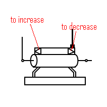
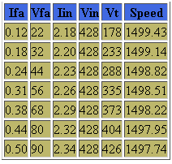
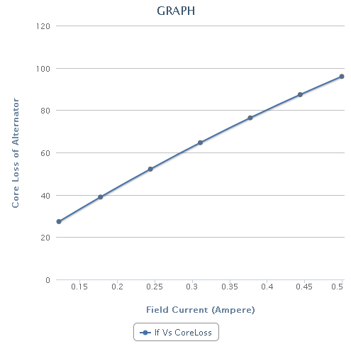

### Open Circuit Test on Three Phase Alternator
1. Close the DPST (Double Pole Single Throw) switch connecting the armature winding of DC shunt motor to supply. Rheostat is used as a potential divider. It is used to increase or decrease the stator voltage of DC shunt motor.

2. Bring the DC shunt motor to rated speed (1500rpm) by clicking the arrows on rheostat.
3. Now, even though field voltage of the generator is zero, we can observe some value at generator output due to residual magnetism.
4. Alternator is brought to synchronous speed (1500rpm) by using DC shunt motor.
5. As DC shunt motor is connected mechanically to alternator, So both machines rotate with same speed. Therefore we can observe speed of alternator.

6. Close the DPST switch connecting the alternator to supply through rheostat.
7. Now increase the field current of alternator by using the rheostat connected to field winding of the alternator.
8. Observe the values of ammeter and voltmeter.
9. Store this data by clicking "Start Storing Data"
10. Go on repeating this procedure till sufficient readings are stored.
11. Now display the data by clicking "Show data". For Ex it will display data as shown:

* Vfa=field voltage of alternator
* Ifa=field current of alternator
* Vin=input voltage DC motor
* Iin=input current of DC motor
* Vt=terminal voltage

12. Now select one of the graph from available graphs and use “Generate graph” to plot the graph. For Ex.

13. Slowly decrease the excitation of DC shunt motor to zero.
14. Switch off supply.